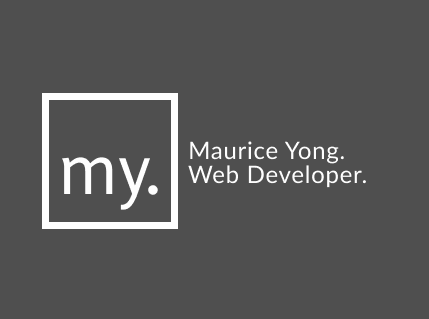

# Portfolio Website
http://mauriceyong.netlify.com/
## Introduction
For my portfolio, I was inspired by clean and highly minimalist designs, and so decided to pursue that look throughout the design.
As a bit of a creative/not-so-creative touch, I am using my initials "M.Y" to personify each section of my site and as a central component of my logo.



My target audience are people looking to recruit me or collaborate with me on projects. Therefore, the site has to portray a highly distilled story of who I am and what I do, that is readable in less than 30 seconds.

To this effect, I decided on a single page scrolling design with bold borders framing each new section.

The sections I will include are "About Me", "Skills", "Work" and "Contact".

## Design
### Considerations
For a clean, readable layout, there must be a good balance of whitespace surrounding elements.

Icons and pictures should be kept to a minimum and be non-distracting. As the site is a scrolling single page, I decided to keep the navigation bar at the top for use only when quick access to one of the sections is needed. The logos at the top of each section are anchored back to the top of the site.

Each section will be framed in a unique colour from the chosen palette and elements within the section will also exhibit the colour to give each section its identity and internal consistency.

### Process
My main contrasting colours are the off-white background against dark navy. To contrast this and add some energy, I went for a variation of pink bordering on orange. And since I had four sections I sought out green as another colour, taking some inspiration from google's colour palette.


I knew right away for a minimalist look I needed sans serif fonts. 'Lato' immediately came to mind, however I spent some time on Google Fonts and discovered 'Rosario' which had a slightly lighter weight than Lato. To headline each section, I chose to use Playfair Display as a formal, serif font, incorporated into a logo.

Designing and wireframing was carried out using Figma (http://figma.io). I went through about 3 iterations of designs until, due to time pressure, I settled on a more familiar and achievable design that I could work with.


My Figma design board can be accessed here:
https://www.figma.com/file/Fu4QTE9mt8yFBOMv0RjdjK3w/Portfolio-Design


## Development Process
While getting the design right in Figma took me about 3 days, translating my design to the browser via code was a different ballgame altogether. 

I started with sectioning my page using ```<section>``` tags and setting up ```<div>``` tags where I knew content was going to be placed.

I knew the navigation bar would pose a significant challenge as I had never made one from scratch. I also chose to work on my site using just basic CSS3 and Flexbox where necessary, as I wanted to practice and be familiar with the basics before moving on to CSS Grid.

### Challenges
Once I started coding, I realised quickly that while I had spent the week before starting on this project learning about CSS, I had done very little practice on actually writing CSS from scratch.

This resulted in a lot of time spent researching and understanding various elements and behaviours of CSS I wanted to implement, as well as a lot of trial and error ensuring what I had designed rendered correctly in the browser. 

The process of trial and error also had me constantly going back to change my design sketch.

### Changes
As time went on however, I realised that my initial design was too simplistic visually, and relied too much on CSS "magic" that was taking me a long time to learn. 

I therefore decided to reject the initial design I was coding on the day leading up to the project deadline and re-designed the page layout, starting from scratch again.

Although it was tiring and incredibly draining with much sleep lost over 2 days, the renewed motivation to complete work on a new design and practice more basic CSS and Flexbox allowed me to push through and deliver the MVP.

## What Next?
There is a lot of work still to be done. Some are a must, and some are for my experimentation and learning. On my list of to-dos, are:
1. Flexbox across all sections for mobile device landscape compatibility

2. my.Work: Animated program language symbols on mouse-hover
3. my.Work: Download link for CV (if necessary?)
4. Parallax "3D" background -- multiple layers (tree canopy? skyscrapers?)
5. Front page: Hero-esque front page before scrolling down to my.Self page
6. my.Self: Better flat icon for representing moi
7. Lightbox effect + Grid-Gallery on project photos


